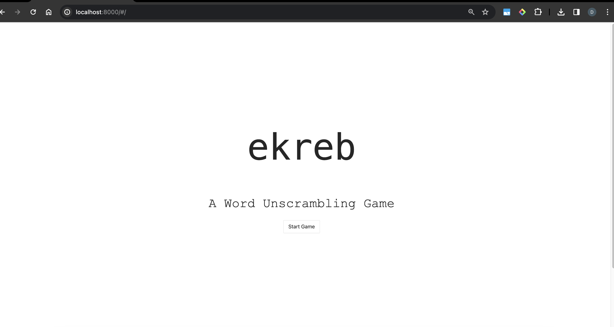
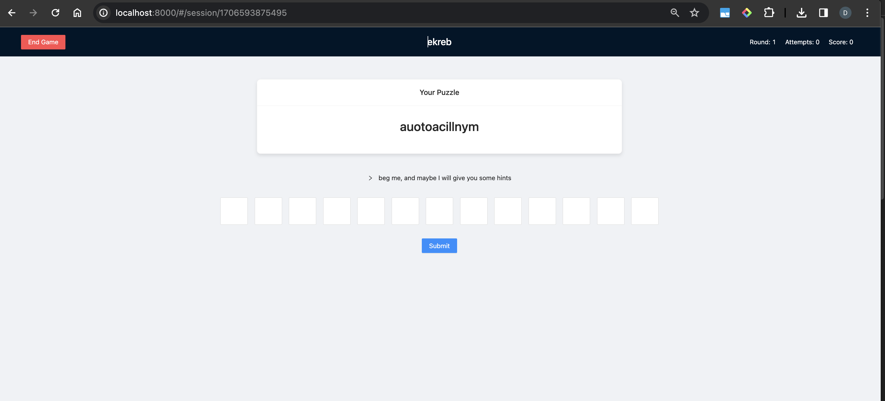
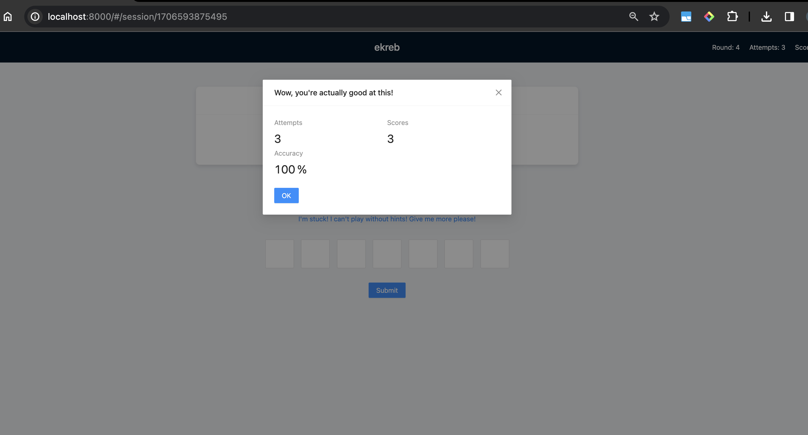

David Huang
david.j.huang@vanderbilt.edu

# EKREB - a word guessing game

This game was created for the programming challenge of Change Plus Plus club. It is a scrambled word guessing game where the user tries to guess a word by looking at its scrambled letters.

## Demo






## Design of the game

The game is organized with sessions. Every time a game starts, the backend creates a new session, which allows multiple players to play at the same time and allows one to continue playing his game as long as one remembers his game’s URL with the session id. 

The front-end is built using ReactJs + dva.js for state management. 

The back-end is built using NodeJs. The front-end and back-end communicate with each other using RESTful API. 

## How to run the program

### front end
first enter the front end directory
`cd ekreb-frontend`

then install dependencies
`npm install`

then start the front end with
`npm run start`


### back end
first enter the back end directory
`cd ekreb-backend`

then install dependencies
`npm install`

then start the back end with
`node server.js`


### environmental information
here are some information about my computer's environment in case anything goes wrong with running the program
```
node --version
v20.1.0

npm --version
9.6.4
```
